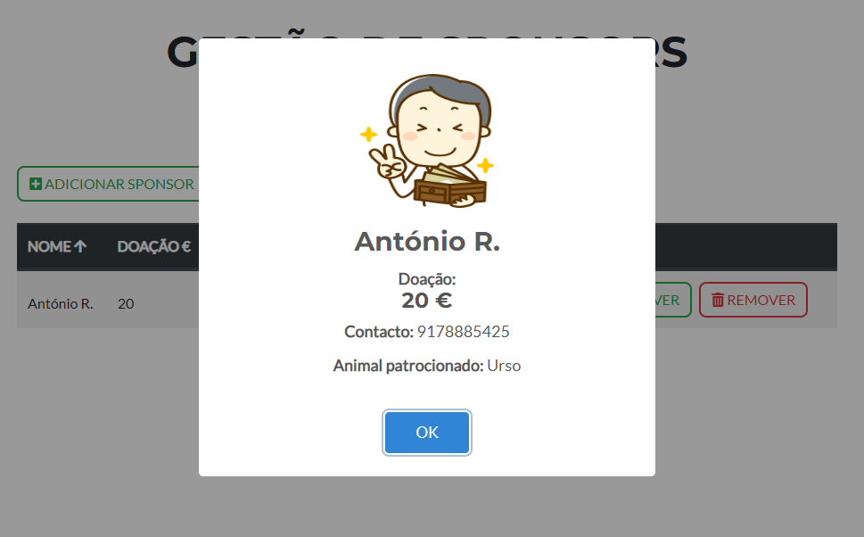

# Animalec now has 2 more features: Experts and Sponsors

## New folders:

views/experts
views/sponsors
store/experts
store/sponsors

## New Files:

api/sponsor.service.js 
store/sponsors/sponsor.constants.js 
store/sponsors/sponsor.constants.js 
AddSponsor.vue 
EditSponsor.vue 
ListSponsor.vue 
assets/avatars/sponsor.png 

api/expert.service.js 
store/experts/expert.constants.js 
store/experts/expert.constants.js 
AddExpert.vue 
EditExpert.vue 
ListExpert.vue 
assets/avatars/expert.png 

## Sponsors Example:

